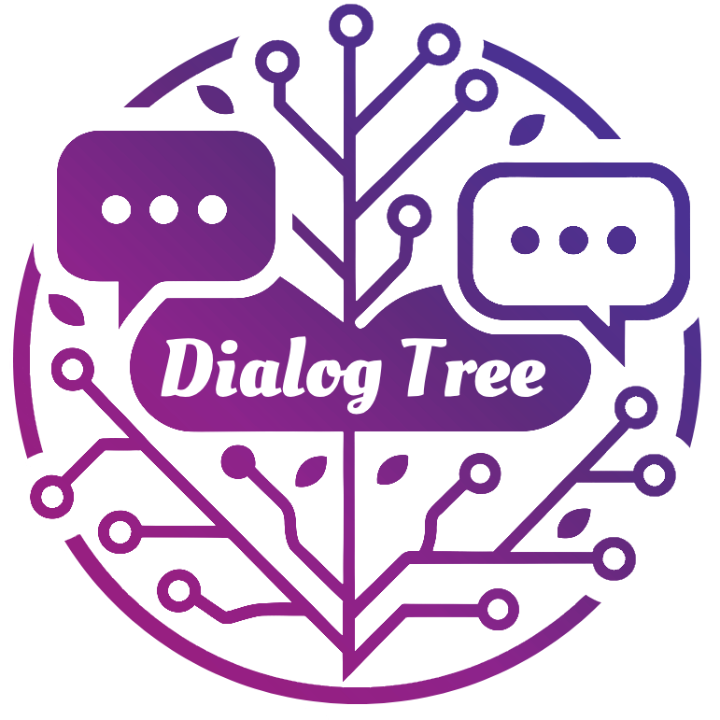

# DialogTree

<div align="center">



**一个支持树状对话结构和向量检索的智能对话系统**

*Build intelligent conversations with tree structure and vector retrieval.*

[](https://golang.org/)
[](https://github.com/gin-gonic/gin)
[](https://gorm.io/)
[](https://qdrant.tech/)
[](https://www.docker.com/)
[](LICENSE)
[](#commercial-license-1)

[English](#english) | [中文文档](#中文)

</div>

---

## 中文

### 📋 项目简介

DialogTree 是一个基于 Go 语言开发的**个人智能对话管理系统**，专为复杂对话场景和**离线部署**设计。系统支持树状对话结构、向量语义检索和智能上下文管理，能够处理分支对话、历史记忆检索等高级特性。

项目**鼓励个人自主部署**，支持完全离线运行，保护数据隐私。以 **Web API 为核心**，提供完整的 RESTful 接口和流式响应支持，同时也提供轻量级 CLI 工具用于快速测试和管理。

🌟 **在线演示**: [chat.golir.top](https://chat.golir.top) | 🏠 **推荐**: 个人部署使用

### ✨ 核心特性

- 🗂️ **分层会话管理**: Session → Dialog(树状) → Conversation 三层架构
- 🧠 **智能上下文**: 短期记忆(N轮对话) + 长期记忆(向量检索)  
- 🔍 **向量语义检索**: 基于 Qdrant 的语义相似度搜索
- 🌐 **Web API 优先**: 完整的 RESTful API + 轻量级 CLI 工具
- 💾 **多数据库支持**: MySQL、PostgreSQL、SQLite
- 🚀 **流式响应**: 支持 Server-Sent Events (SSE) 流式输出
- 🔄 **多 AI 提供商**: OpenAI、DeepSeek、ChatAnywhere
- 🛡️ **高级特性**: 高性能向量检索、会话管理、分支对话
- 🏠 **个人部署**: 支持单机部署，数据完全私有化
- 🔒 **离线使用**: 无需依赖云服务，完全本地化运行
- 🎯 **精准控制**: 自主选择 AI 提供商和数据存储

### 🏗️ 系统架构

```
┌─────────────────┐    ┌─────────────────┐
│   Web Frontend  │    │  CLI Tools      │
│    (Vue.js)     │    │  (Simple Chat)  │
└─────────┬───────┘    └─────────┬───────┘
          │                      │
          ▼                      ▼
┌─────────────────────────────────────────┐
│              Gin Router                 │
│    /api/sessions  /api/dialog           │
└─────────────────┬───────────────────────┘
                  │
          ┌───────▼───────┐
          │  API Layer    │
          │ session_api   │
          │  dialog_api   │
          └───────┬───────┘
                  │
          ┌───────▼───────┐
          │ Service Layer │
          │ dialog_service│
          │vector_service │
          │embedding_svc  │
          └───────┬───────┘
                  │
    ┌─────────────┼─────────────┐
    ▼             ▼             ▼
┌──────────┐  ┌─────────┐  ┌─────────┐
│PostgreSQL│  │  Redis  │  │ Qdrant  │
│(主数据)   │  │ (缓存)   │  │(向量DB) │
└──────────┘  └─────────┘  └─────────┘
```

### 📁 项目结构

```
DialogTree/
├── api/                    # API 层
│   ├── session_api/        # 会话管理 API
│   ├── dialog_api/         # 对话交互 API  
│   └── category_api/       # 分类管理 API
├── service/                # 业务逻辑层
│   ├── dialog_service/     # 对话服务
│   ├── vector_service/     # 向量检索服务
│   ├── embedding_service/  # 文本向量化服务
│   ├── ai_service/         # AI 服务提供商
│   └── tea_service/        # CLI UI 服务
├── router/                 # 路由层
│   ├── gin_router/         # Web API 路由
│   └── cli_router/         # CLI 路由
├── models/                 # 数据模型
├── core/                   # 核心初始化
├── conf/                   # 配置管理
├── middleware/             # 中间件
├── cli/                    # CLI 界面
├── init/deploy/            # 部署配置
├── docker/                 # Docker 配置
└── logs/                   # 日志文件
```

### 🚀 快速开始

> 🌟 **在线体验**: [chat.golir.top](https://chat.golir.top) 查看实际效果
> 
> 🏠 **推荐部署**: 个人单机部署，数据完全私有化，支持离线使用

#### 环境要求

- Go 1.24+ (用于编译)
- Docker & Docker Compose (可选，用于快速部署)
- MySQL/PostgreSQL/SQLite (任选其一，推荐 SQLite 用于个人使用)

#### 1. 克隆项目

```bash
git clone https://github.com/yourusername/DialogTree.git
cd DialogTree
```

#### 2. 配置环境

复制并编辑配置文件：

```bash
cp config.yaml.example config.yaml
```

编辑 `config.yaml` 配置数据库和 AI 服务：

```yaml
db:
  source: mysql  # mysql/postgres/sqlite
  host: 127.0.0.1
  port: 3306
  dbname: dialog_tree
  user: root
  password: your_password

ai:
  openai:
    secretKey: your_openai_api_key
  # 或其他 AI 提供商配置

vector:
  enable: true
  provider: qdrant
  qdrant:
    host: 127.0.0.1
    port: 6333
```

#### 3. 启动依赖服务

```bash
# 启动 Qdrant 向量数据库
docker run -d -p 6333:6333 qdrant/qdrant

# 或使用完整的 docker-compose (包含数据库)
cd init/deploy
docker-compose up -d
```

#### 4. 安装依赖并编译

```bash
go mod tidy
go build -o dialogTree
```

#### 5. 初始化数据库

```bash
./dialogTree migratedb
```

#### 6. 运行项目

**启动 Web 服务 (默认端口 8080):**

```bash
./dialogTree
# 或
./dialogTree server
```

访问 http://localhost:8080 查看 API 文档和状态。

**CLI 快速工具:**

```bash
# 快速聊天（无状态，适合测试）
./dialogTree chitchat

# 数据库管理
./dialogTree migratedb  # 初始化数据库
./dialogTree resetdb    # 重置数据库
```

> **注意**: 完整的对话管理功能请使用 Web API 或前端界面，CLI 主要用于快速测试和数据库管理。

### 🏠 为什么选择个人部署？

相比于在线服务，个人部署 DialogTree 有以下优势：

#### 🔒 数据隐私保护
- 所有对话数据存储在本地，绝不上传第三方
- AI API 调用可以使用自己的 API Key
- 向量数据存储在本地 Qdrant 实例

#### 💰 成本控制
- 一次性部署，无月费成本
- 自主选择 AI 提供商，获得最优价格
- 本地存储，无数据传输费用

#### ⚙️ 完全控制
- 自由选择数据库类型 (MySQL/PostgreSQL/SQLite)
- 可以离线使用，不依赖网络
- 支持个性化配置和功能定制

#### 🛡️ 稳定可靠
- 不受第三方服务停机影响
- 数据完全掌控，永不丢失
- 可以根据需要进行备份和迁移

### 🌐 API 接口

#### 会话管理

```bash
# 获取会话列表
GET /api/sessions

# 创建新会话
POST /api/sessions
{
  "title": "我的对话",
  "categoryID": 1
}

# 获取对话树
GET /api/sessions/:id/tree

# 删除会话
DELETE /api/sessions/:id
```

#### 对话交互

```bash
# 流式对话
POST /api/dialog/chat
{
  "content": "你好",
  "sessionId": 1
}

# 同步对话
POST /api/dialog/chat/sync
{
  "content": "你好", 
  "sessionId": 1
}

# 标星对话
PUT /api/conversations/:id/star

# 添加评论
PUT /api/conversations/:id/comment
{
  "comment": "很有用的回答"
}
```

### 🧠 智能上下文机制

#### 短期记忆
- 从当前节点往上追溯 N 轮对话(可配置)
- 使用对话摘要而非完整内容，节省 token

#### 长期记忆
- 自动向量化所有问答对
- 基于问题相似度检索历史相关内容
- 支持会话级别的记忆隔离

#### 上下文构建流程
```
新问题 → embedding → 向量检索(topK) → 组合短期上下文 → 发送给AI
         ↓
    AI回复 → 保存到数据库 → 向量化存储
```

### 🔧 配置说明

主要配置项说明：

```yaml
ai:
  contextLayers: 3                    # 短期记忆层数
  embeddingModel: "text-embedding-3-small"
  embeddingProvider: "openai"         # openai/deepseek/chatanywhere

vector:
  enable: true
  provider: "qdrant"
  topK: 5                            # 向量检索返回数
  similarityThreshold: 0.7           # 相似度阈值

system:
  demo: false                        # 演示模式
  demoTimer: 4                       # 演示模式超时(秒)
```

### 🐳 Docker 部署

#### 使用 Docker Compose

```bash
cd init/deploy
docker-compose up -d
```

#### 手动构建镜像

```bash
docker build -t dialog_tree:latest .
docker run -d -p 8080:8080 dialog_tree:latest
```

#### 一键部署脚本

```bash
# 编辑 deploy.sh 中的服务器配置
./deploy.sh
```

### 📝 使用示例

#### Web 前端示例

启动服务后，可以通过前端界面或直接调用 API：

- 前端界面: http://localhost:8080 (如果配置了前端)
- API 文档: http://localhost:8080/api/docs (如果启用了 Swagger)

#### CLI 快速测试

```bash
# 快速聊天测试
$ ./dialogTree chitchat
> 你好，我想学习Go语言
[AI 回复...]
```

#### API 调用示例

```bash
# 创建会话
curl -X POST http://localhost:8080/api/sessions \
  -H "Content-Type: application/json" \
  -d '{"title": "学习讨论", "categoryID": 1}'

# 发起对话
curl -X POST http://localhost:8080/api/dialog/chat/sync \
  -H "Content-Type: application/json" \
  -d '{"content": "解释一下Go的并发模型", "sessionId": 1}'
```

### 🧪 测试

```bash
# 运行所有测试
go test ./...

# 运行特定模块测试
go test ./service/dialog_service/...

# 运行基准测试
go test -bench=. ./...
```

### 🤝 贡献指南

1. Fork 项目
2. 创建特性分支 (`git checkout -b feature/AmazingFeature`)
3. 提交更改 (`git commit -m 'Add some AmazingFeature'`)
4. 推送分支 (`git push origin feature/AmazingFeature`)
5. 创建 Pull Request


### 🙏 致谢

- [Gin](https://github.com/gin-gonic/gin) - Web 框架
- [GORM](https://gorm.io/) - ORM 库
- [Qdrant](https://qdrant.tech/) - 向量数据库
- [Bubble Tea](https://github.com/charmbracelet/bubbletea) - CLI UI 框架

---

## English

### 📋 Project Overview

DialogTree is a **personal intelligent dialog management system** built with Go, specifically designed for complex conversation scenarios and **offline deployment**. The system supports tree-structured conversations, vector semantic retrieval, and intelligent context management, capable of handling advanced features like branching dialogs and historical memory retrieval.

The project **encourages personal self-deployment**, supports completely offline operation, and protects data privacy. It is **Web API-focused**, providing complete RESTful interfaces with streaming response support, while also offering lightweight CLI tools for quick testing and management.

🌟 **Live Demo**: [chat.golir.top](https://chat.golir.top) | 🏠 **Recommended**: Personal deployment

### ✨ Key Features

- 🗂️ **Hierarchical Session Management**: Session → Dialog(Tree) → Conversation architecture
- 🧠 **Smart Context**: Short-term memory (N rounds) + Long-term memory (vector retrieval)
- 🔍 **Vector Semantic Search**: Qdrant-based semantic similarity search
- 🌐 **Web API First**: Complete RESTful API + Lightweight CLI tools
- 💾 **Multi-Database Support**: MySQL, PostgreSQL, SQLite
- 🚀 **Streaming Response**: Server-Sent Events (SSE) support
- 🔄 **Multiple AI Providers**: OpenAI, DeepSeek, ChatAnywhere
- 🛡️ **Advanced Features**: High-performance vector retrieval, session management, branching dialogs
- 🏠 **Personal Deployment**: Support single-machine deployment, fully private data
- 🔒 **Offline Usage**: No cloud service dependency, completely local operation
- 🎯 **Precise Control**: Choose your own AI providers and data storage

### 🏗️ System Architecture

```
┌─────────────────┐    ┌─────────────────┐
│   Web Frontend  │    │  CLI Tools      │
│    (Vue.js)     │    │  (Simple Chat)  │
└─────────┬───────┘    └─────────┬───────┘
          │                      │
          ▼                      ▼
┌─────────────────────────────────────────┐
│              Gin Router                 │
│    /api/sessions  /api/dialog           │
└─────────────────┬───────────────────────┘
                  │
          ┌───────▼───────┐
          │  API Layer    │
          │ session_api   │
          │  dialog_api   │
          └───────┬───────┘
                  │
          ┌───────▼───────┐
          │ Service Layer │
          │ dialog_service│
          │vector_service │
          │embedding_svc  │
          └───────┬───────┘
                  │
    ┌─────────────┼─────────────┐
    ▼             ▼             ▼
┌──────────┐  ┌─────────┐  ┌─────────┐
│PostgreSQL│  │  Redis  │  │ Qdrant  │
│(Primary)  │  │ (Cache) │  │(Vector) │
└──────────┘  └─────────┘  └─────────┘
```

### 📁 Project Structure

```
DialogTree/
├── api/                    # API Layer
│   ├── session_api/        # Session Management API
│   ├── dialog_api/         # Dialog Interaction API  
│   └── category_api/       # Category Management API
├── service/                # Business Logic Layer
│   ├── dialog_service/     # Dialog Service
│   ├── vector_service/     # Vector Retrieval Service
│   ├── embedding_service/  # Text Embedding Service
│   ├── ai_service/         # AI Service Providers
│   └── tea_service/        # CLI UI Service
├── router/                 # Routing Layer
│   ├── gin_router/         # Web API Router
│   └── cli_router/         # CLI Router
├── models/                 # Data Models
├── core/                   # Core Initialization
├── conf/                   # Configuration Management
├── middleware/             # Middleware
├── cli/                    # CLI Interface
├── init/deploy/            # Deployment Configuration
├── docker/                 # Docker Configuration
└── logs/                   # Log Files
```

### 🚀 Quick Start

> 🌟 **Live Demo**: [chat.golir.top](https://chat.golir.top) to see it in action
> 
> 🏠 **Recommended Deployment**: Personal single-machine deployment with fully private data and offline support

#### Prerequisites

- Go 1.24+ (for compilation)
- Docker & Docker Compose (optional, for quick deployment)
- MySQL/PostgreSQL/SQLite (choose one, SQLite recommended for personal use)

#### 1. Clone the Repository

```bash
git clone https://github.com/yourusername/DialogTree.git
cd DialogTree
```

#### 2. Configuration

Copy and edit the configuration file:

```bash
cp config.yaml.example config.yaml
```

Edit `config.yaml` to configure database and AI services:

```yaml
db:
  source: mysql  # mysql/postgres/sqlite
  host: 127.0.0.1
  port: 3306
  dbname: dialog_tree
  user: root
  password: your_password

ai:
  openai:
    secretKey: your_openai_api_key
  # Or other AI provider configurations

vector:
  enable: true
  provider: qdrant
  qdrant:
    host: 127.0.0.1
    port: 6333
```

#### 3. Start Dependencies

```bash
# Start Qdrant vector database
docker run -d -p 6333:6333 qdrant/qdrant

# Or use full docker-compose (including database)
cd init/deploy
docker-compose up -d
```

#### 4. Install Dependencies and Build

```bash
go mod tidy
go build -o dialogTree
```

#### 5. Initialize Database

```bash
./dialogTree migratedb
```

#### 6. Run the Application

**Start Web Service (default port 8080):**

```bash
./dialogTree
# or
./dialogTree server
```

Visit http://localhost:8080 to view API documentation and status.

**CLI Quick Tools:**

```bash
# Quick chat (stateless, for testing)
./dialogTree chitchat

# Database management
./dialogTree migratedb  # Initialize database
./dialogTree resetdb    # Reset database
```

> **Note**: For complete dialog management features, please use Web API or frontend interface. CLI is mainly for quick testing and database management.

### 🏠 Why Choose Personal Deployment?

Compared to online services, personal deployment of DialogTree offers the following advantages:

#### 🔒 Data Privacy Protection
- All conversation data stored locally, never uploaded to third parties
- AI API calls can use your own API keys
- Vector data stored in local Qdrant instance

#### 💰 Cost Control
- One-time deployment, no monthly subscription costs
- Choose your own AI providers for best pricing
- Local storage, no data transfer fees

#### ⚙️ Complete Control
- Free choice of database type (MySQL/PostgreSQL/SQLite)
- Can be used offline, no network dependency
- Support personalized configuration and feature customization

#### 🛡️ Stable and Reliable
- Not affected by third-party service outages
- Complete data control, never lost
- Can backup and migrate as needed

### 🌐 API Endpoints

#### Session Management

```bash
# Get session list
GET /api/sessions

# Create new session
POST /api/sessions
{
  "title": "My Dialog",
  "categoryID": 1
}

# Get dialog tree
GET /api/sessions/:id/tree

# Delete session
DELETE /api/sessions/:id
```

#### Dialog Interaction

```bash
# Streaming dialog
POST /api/dialog/chat
{
  "content": "Hello",
  "sessionId": 1
}

# Synchronous dialog
POST /api/dialog/chat/sync
{
  "content": "Hello", 
  "sessionId": 1
}

# Star conversation
PUT /api/conversations/:id/star

# Add comment
PUT /api/conversations/:id/comment
{
  "comment": "Very helpful answer"
}
```

### 🧠 Smart Context Mechanism

#### Short-term Memory
- Traces back N rounds of dialog from current node (configurable)
- Uses dialog summaries instead of full content to save tokens

#### Long-term Memory
- Automatically vectorizes all Q&A pairs
- Retrieves historically relevant content based on question similarity
- Supports session-level memory isolation

#### Context Building Process
```
New Question → embedding → Vector Retrieval(topK) → Combine Short-term Context → Send to AI
              ↓
         AI Reply → Save to Database → Vectorize and Store
```

### 🔧 Configuration

Key configuration options:

```yaml
ai:
  contextLayers: 3                    # Short-term memory layers
  embeddingModel: "text-embedding-3-small"
  embeddingProvider: "openai"         # openai/deepseek/chatanywhere

vector:
  enable: true
  provider: "qdrant"
  topK: 5                            # Vector retrieval return count
  similarityThreshold: 0.7           # Similarity threshold

system:
  demo: false                        # Demo mode
  demoTimer: 4                       # Demo mode timeout (seconds)
```

### 🐳 Docker Deployment

#### Using Docker Compose

```bash
cd init/deploy
docker-compose up -d
```

#### Manual Image Build

```bash
docker build -t dialog_tree:latest .
docker run -d -p 8080:8080 dialog_tree:latest
```

#### One-click Deployment Script

```bash
# Edit server configuration in deploy.sh
./deploy.sh
```

### 📝 Usage Examples

#### Web Frontend Examples

After starting the service, you can access it through frontend interface or direct API calls:

- Frontend Interface: http://localhost:8080 (if frontend is configured)
- API Documentation: http://localhost:8080/api/docs (if Swagger is enabled)

#### CLI Quick Testing

```bash
# Quick chat testing
$ ./dialogTree chitchat
> Hello, I want to learn Go
[AI Response...]
```

#### API Call Examples

```bash
# Create session
curl -X POST http://localhost:8080/api/sessions \
  -H "Content-Type: application/json" \
  -d '{"title": "Learning Discussion", "categoryID": 1}'

# Start dialog
curl -X POST http://localhost:8080/api/dialog/chat/sync \
  -H "Content-Type: application/json" \
  -d '{"content": "Explain Go concurrency model", "sessionId": 1}'
```

### 🧪 Testing

```bash
# Run all tests
go test ./...

# Run specific module tests
go test ./service/dialog_service/...

# Run benchmark tests
go test -bench=. ./...
```

### 🤝 Contributing

1. Fork the project
2. Create your feature branch (`git checkout -b feature/AmazingFeature`)
3. Commit your changes (`git commit -m 'Add some AmazingFeature'`)
4. Push to the branch (`git push origin feature/AmazingFeature`)
5. Open a Pull Request

### 📄 许可证 / License

本项目采用双重许可模式：

#### 🆓 开源许可证 (推荐)
- **AGPL v3**: 适用于开源项目和**个人部署使用**
- 鼓励个人自主部署，数据完全私有化
- 👍 **完美适用**: 个人使用、学习研究、内部工具
- 如果你基于本项目开发网络服务，必须开源你的完整代码
- 查看 [LICENSE](LICENSE) 文件了解详情

#### 💼 商业许可证
- **商业许可**: 适用于不想开源的商业项目
- 允许闭源使用和商业化
- 包含技术支持和定制服务
- 联系方式: [商业咨询](#commercial-license-1)

---

This project uses dual licensing:

#### 🆓 Open Source License (Recommended)
- **AGPL v3**: For open source projects and **personal deployment**
- Encourages personal self-deployment with fully private data
- 👍 **Perfect for**: Personal use, learning research, internal tools
- If you use this project for network services, you must open source your complete code
- See [LICENSE](LICENSE) file for details

#### 💼 Commercial License
- **Commercial License**: For commercial projects that don't want to open source
- Allows closed-source usage and commercialization
- Includes technical support and customization services
- Contact: [Commercial Inquiry](#commercial-license-1)

<a id="commercial-license-1"></a>
### 💼 Commercial License

如果你需要在商业项目中使用 DialogTree 但不希望开源你的代码，我们提供商业许可证。

If you need to use DialogTree in commercial projects without open sourcing your code, we offer commercial licenses.

#### 🎦 商业许可特权 / Commercial License Benefits

- ✅ **闭源使用权**: 不需要开源你的代码 / Closed-source usage rights
- ✅ **商业化权利**: 允许商业化你的产品 / Commercial distribution rights
- ✅ **技术支持**: 专业技术支持和咨询 / Professional technical support
- ✅ **定制开发**: 专门的功能定制服务 / Custom development services
- ✅ **优先更新**: 优先获得新版本和特性 / Priority updates and features

#### 📝 适合场景 / Use Cases

- 企业级 AI 对话系统 / Enterprise AI dialog systems
- SaaS 对话平台 / SaaS conversation platforms
- 内部企业工具 / Internal enterprise tools
- 定制客服系统 / Custom customer service systems

#### 📧 联系方式 / Contact Information

商业许可咨询，请通过以下方式联系我们：

For commercial licensing inquiries, please contact us:

- 📧 **Email**: commercial@dialogtree.io
- 📞 **微信 / WeChat**: DialogTreeBiz
- 🌐 **网站 / Website**: https://dialogtree.io/commercial
- 📅 **在线咨询 / Online Consultation**: [点击这里 / Click Here](https://cal.com/dialogtree)

> 💰 **价格策略**: 我们提供灵活的价格方案，包括一次性购买、订阅模式和企业定制方案。
> 
> **Pricing**: We offer flexible pricing options including one-time purchase, subscription plans, and enterprise custom solutions.

### 🙏 Acknowledgments

- [Gin](https://github.com/gin-gonic/gin) - Web Framework
- [GORM](https://gorm.io/) - ORM Library
- [Qdrant](https://qdrant.tech/) - Vector Database
- [Bubble Tea](https://github.com/charmbracelet/bubbletea) - CLI UI Framework